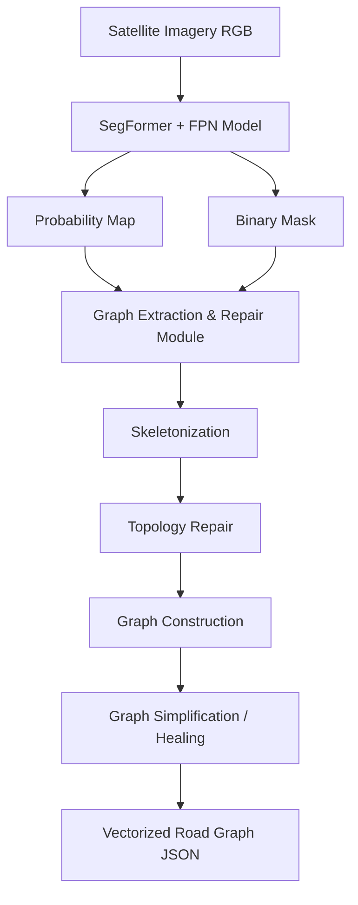

# Road Extraction and Graph Generation Pipeline Architecture

This document provides a high-level overview of the end-to-end architecture for the road extraction and vector graph generation pipeline. The pipeline is designed to ingest satellite imagery, extract road networks using a deep learning segmentation model, and convert these pixel-level predictions into a topological vector graph representation, complete with automated topology repair.

---

## 1. High-Level Architecture Overview

The system is divided into two primary sequential stages:
1. **Machine Learning (Segmentation) Pipeline**: Processes raw satellite imagery to output rasterized road masks and probability maps.
2. **Graph Extraction & Repair Module**: Converts the rasterized masks into mathematical graphs (nodes and edges), bridging gaps caused by occlusions or model uncertainty.



---

## 2. Machine Learning Pipeline

```text
RGB Satellite Image (512×512×3)
        ↓
┌─────────────────────────────────────────┐
│  ENCODER: SegFormer MiT-B2              │
│  (hierarchical vision transformer)      │
│  - 4 stages, produces multi-scale       │
│    features at 1/4, 1/8, 1/16, 1/32     │
│  - efficient self-attention             │
│  - ImageNet-pretrained                  │
└─────────────────────────────────────────┘
        ↓ (multi-scale feature maps)
┌─────────────────────────────────────────┐
│  DECODER: FPN                           │
│  (Feature Pyramid Network)              │
│  - aggregates multi-scale features      │
│  - merges semantic/spatial info         │
│  - recovers thin road detail            │
└─────────────────────────────────────────┘
        ↓
   1-channel Road Mask (512×512×1, sigmoid)
```

### 2.1 Key Components
- **Encoder**: MiT-B2 (Mix Transformer B2) — the transformer backbone from SegFormer. Hierarchical (CNN-like multi-scale pyramid) but transformer-based, giving global reasoning for occlusion. ImageNet-pretrained.
- **Decoder**: FPN (Feature Pyramid Network) — aggregates multi-scale features from the encoder, producing high-resolution, pixel-level predictions.
- **Library**: `segmentation_models_pytorch` → `smp.FPN(encoder_name="mit_b2", encoder_weights="imagenet", in_channels=3, classes=1)`

### 2.2 Training Configuration
- **Dataset**: DeepGlobe Road Extraction
- **Split**: 80% train / 20% val, seed 67
- **Input**: 512×512
- **Loss**: 0.5 × BCE + 0.5 × clDice (BCE for pixel accuracy, clDice for topology/connectivity)
- **Optimizer**: AdamW, lr = 1e-4, weight_decay = 1e-4
- **Scheduler**: ReduceLROnPlateau (mode='max', factor=0.5, patience=2)
- **Epochs**: 30
- **Augmentation**: `albumentations` (flips, rotations, color jitter, etc.)

### 2.3 Best Observed Metrics
```text
═══════════════════════════════════════
  Train IoU:                      ≈ 0.58
  Validation IoU:                 ≈ 0.55
  
  Full Dataset IoU:               ≈ 0.61
  F1-Score (Dice):                ≈ 0.76
  Recall (w/ spec. binarization): ≈ 0.88
  Precision:                      ≈ 0.70
═══════════════════════════════════════
```

---

## 3. Graph Extraction & Repair Module

Once the ML model produces a binary mask and a probability map, the graph module vectorizes the raster data into a topological network.

### 3.1 Skeletonization
The binary mask is reduced to a 1-pixel-wide centerline using morphological skeletonization (e.g., `skimage.morphology.skeletonize`). This forms the base geometry of the road network.

### 3.2 Endpoint & Branch Detection
- **Branch Points (Junctions)**: Pixels with more than two 8-connected neighbors are identified as intersections.
- **Endpoints (Dead-ends)**: Pixels with exactly one 8-connected neighbor are identified as the termini of roads. At each endpoint, a local tangent vector is estimated using PCA to determine the road's direction.

### 3.3 Topology Repair
Segmentation models often produce disconnected road segments due to tree cover, shadows, or model failures. The topology repair submodule attempts to bridge these gaps:
1. **Candidate Generation**: Potential connections are proposed between pairs of endpoints or between an endpoint and a nearby branch.
2. **Scoring**: Candidates are scored based on Euclidean distance, tangent alignment (whether the roads point towards each other), and probability values.
3. **Pathfinding (Bidirectional A\*)**: The highest-scoring candidates are routed using a Bidirectional A* search over the model's original **probability map**. This ensures the repaired connection follows the most likely road path predicted by the model, rather than just a straight line.

### 3.4 Graph Construction
The repaired skeleton is converted into a standard graph format (e.g., `NetworkX`):
- **Nodes**: Represent junctions and endpoints. They store spatial coordinates `(x, y)`.
- **Edges**: Represent the continuous road segments between nodes. They store the exact pixel path coordinates and the length of the segment.

### 3.5 Graph Healing & Simplification
To clean up artifacts from skeletonization and raster-to-vector conversion, several simplification routines are applied:
- **Spur Pruning**: Short dead-end branches (spurs) that fall below a certain length threshold are removed.
- **Degree-2 Node Collapse**: Nodes with exactly two neighbors (which merely act as waypoints on a continuous road) are removed, merging the two adjacent edges into a single, longer edge.

### 3.6 Output
The final structure is exported as a serialized JSON or graph format containing nodes, edges, and geometries, ready for downstream routing, mapping, or analysis tasks.
