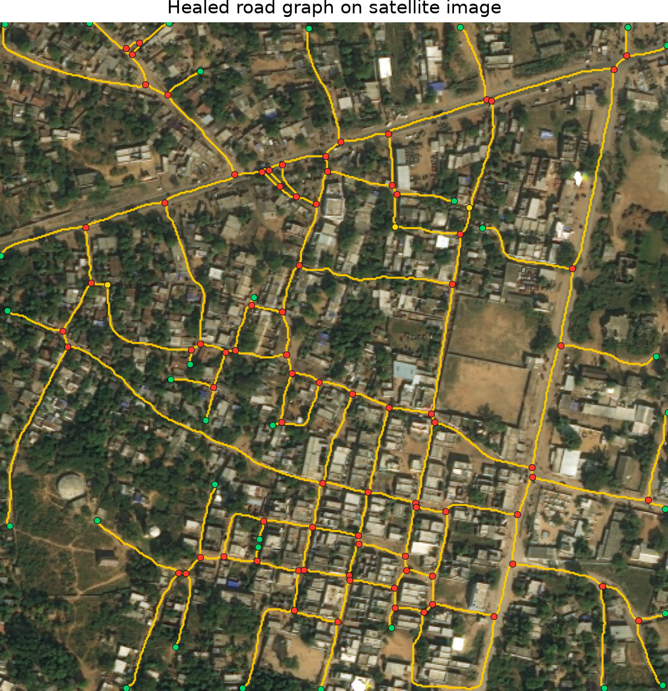
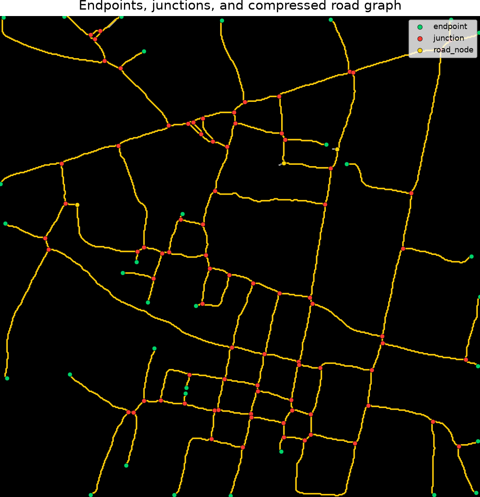
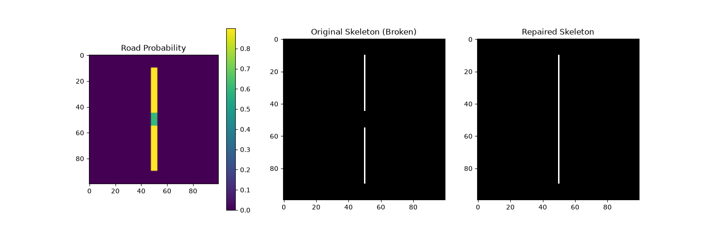

# Route Resilience — Road Extraction & Graph Generation

> **Satellite imagery → segmentation mask → vectorized road graph** — a full end-to-end pipeline for extracting, topologically repairing, and exporting road networks from aerial imagery.

[](https://www.kaggle.com/datasets/balraj98/deepglobe-road-extraction-dataset)
[-orange)](https://drive.google.com/drive/folders/1TuOQP6J5ACCI0yj2q9l7oIeNnTHTcQeX?usp=sharing)
[](https://routeresilience.onrender.com/)

---

## What This Project Does

This system takes a raw satellite image and produces a **structured, topological road graph** ,the kind of data that can power routing engines, urban planning tools, or change-detection systems.

The pipeline runs in two sequential stages:

1. **Segmentation** — A SegFormer transformer model predicts which pixels are roads, producing a binary mask and a confidence probability map.
2. **Graph Extraction** — The mask is skeletonized, broken segments are reconnected using Bidirectional A\* search, and the result is exported as nodes and edges (JSON) ready for downstream use.

---

## Architecture Overview

### Stage 1 · Segmentation Model

The segmentation model combines a **SegFormer MiT-B2 encoder** (a hierarchical vision transformer) with an **FPN decoder** (Feature Pyramid Network), implemented via `segmentation_models_pytorch`. Trained on the [DeepGlobe Road Extraction dataset](https://www.kaggle.com/datasets/balraj98/deepglobe-road-extraction-dataset) at 512×512 resolution.

| Component | Detail |
|---|---|
| **Encoder** | MiT-B2 — 4-stage hierarchical transformer, ImageNet-pretrained |
| **Decoder** | FPN — aggregates multi-scale features, recovers fine road detail |
| **Loss** | 0.5 × Binary Cross-Entropy + 0.5 × clDice (connectivity-preserving) |
| **Optimizer** | AdamW, lr=1e-4, weight_decay=1e-4 |
| **Scheduler** | ReduceLROnPlateau (patience=2) |

> **clDice** is a topology-aware loss that penalizes disconnected predictions — crucial for thin, branching road networks.

### Stage 2 · Graph Extraction & Repair

Once the model produces a binary mask, the graph module vectorizes it into a topological network:

```
Binary Mask + Probability Map
         ↓
  Morphological Cleanup
         ↓
    Skeletonization          ← reduces road pixels to 1-pixel-wide centerlines
         ↓
  Topology Repair            ← Bidirectional A* bridges gaps from occlusions
         ↓
  Graph Construction         ← NetworkX: junctions = nodes, segments = edges
         ↓
  Graph Simplification       ← spur pruning, degree-2 node collapse
         ↓
  Export: nodes.json + edges.json
```

For a deep dive into the graph module, see [GRAPH_PIPELINE_DOC.md](./GRAPH_PIPELINE_DOC.md).
For full architecture details, see [ARCHITECTURE.md](./ARCHITECTURE.md).

---

## Results

| Metric | Value |
|---|---|
| **Full Dataset IoU** | ≈ 0.61 |
| **F1-Score (Dice)** | ≈ 0.76 |
| **Recall** | ≈ 0.88 (with tuned binarization) |
| **Precision** | ≈ 0.70 |
| Validation IoU | ≈ 0.55 |

### Sample Outputs

**Healed road graph overlaid on satellite imagery:**



**Graph nodes and edges (compressed road graph):**



**Topology repair — before & after (synthetic test):**



> 🟢 **Green dots** = road endpoints (dead-ends) · 🔴 **Red dots** = junctions (intersections) · 🟡 **Yellow lines** = graph edges

---

## Project Structure

```
Route-Resilience/
│
├── graph_module/               # Graph extraction pipeline
│   ├── run_pipeline.py         #   ← Entry point for graph generation
│   ├── endpoint_detection.py   #   Dead-end & tangent detection
│   ├── branch_detection.py     #   Junction (branch point) detection
│   ├── candidate_pairs.py      #   Repair candidate scoring
│   ├── scoring.py              #   6-term cost function for A*
│   ├── astar.py                #   Bidirectional A* search
│   ├── topology_repair.py      #   Orchestrates the repair loop
│   ├── validation.py           #   Multi-metric path acceptance
│   ├── debug_viz.py            #   Debug overlays and logs
│   ├── graph_builder.py        #   Skeleton → NetworkX graph
│   └── graph_healing.py        #   Simplification & spur pruning
│
├── train.py                    # Model training script
├── evaluate.py                 # Validation split evaluation
├── evaluate_full.py            # Full-dataset evaluation
├── export_predictions.py       # Export binary masks from model
├── run_random_samples.py       # Batch graph extraction driver
├── plot_graphs.py              # Batch graph visualization
├── soft_cldice_loss.py         # clDice loss implementation
│
├── train/ valid/ test/         # Dataset splits (sat images + masks)
├── pred_masks/                 # Model-exported binary masks
├── graph_test/                 # Graph output from a single run
├── graph_random_samples/       # Batch graph outputs
│
├── best_model.pth              # Trained model weights (299 MB)
├── requirements.txt
└── README.md
```

---

## Getting Started

### Prerequisites

Python 3.9+ and a CUDA-capable GPU are recommended. CPU inference is possible but slow.

### 1. Install dependencies

```bash
pip install -r requirements.txt
```

Key libraries: `torch`, `segmentation-models-pytorch`, `albumentations`, `scikit-image`, `networkx`, `opencv-python`.

### 2. Download model weights

The trained weights (`best_model.pth`, 299 MB) are hosted on Hugging Face:

👉 **[Download best_model.pth](https://drive.google.com/drive/folders/1TuOQP6J5ACCI0yj2q9l7oIeNnTHTcQeX?usp=sharing)**

Place the file in the project root directory.

### 3. Run inference on your own images

Export binary masks from the trained model:

```bash
python export_predictions.py
```

This writes predicted masks to `pred_masks/` — required input for the graph pipeline.

### 4. Generate a road graph

```bash
python graph_module/run_pipeline.py \
    --mask pred_masks/your_image_pred.png \
    --prob-map pred_masks/your_image_prob.npy \
    --satellite valid/your_image_sat.jpg \
    --output-dir graph_output
```

The `--prob-map` argument enables topology repair via A\*. Without it, the pipeline uses a simpler gap-bridging strategy.

**Key optional flags:**

| Flag | Effect |
|---|---|
| `--no-repair` | Skip topology repair (faster, less accurate) |
| `--no-simplify` | Keep the raw graph without spur pruning |
| `--endpoint-distance N` | Max gap distance (px) to attempt repair |
| `--heading-angle N` | Max tangent deviation angle for candidates |
| `--junction-merge-distance N` | Merge junctions closer than N pixels |

---

## Training From Scratch

The model is trained on the [DeepGlobe Road Extraction dataset](https://www.kaggle.com/datasets/balraj98/deepglobe-road-extraction-dataset). Place satellite images (`*_sat.jpg`) and masks (`*_mask.png`) in `train/`, then run:

```bash
python train.py
```

Training runs for 30 epochs by default with an 80/20 train/validation split. The best checkpoint is saved as `best_model.pth`.

---

## Topology Repair: How It Works

Segmentation models commonly produce **broken road skeletons** — gaps caused by tree canopy, shadows, or low model confidence. The repair module bridges these gaps in three progressive stages:

1. **Candidate generation** — pairs of road endpoints within a search radius are scored using geometric alignment (tangent dot products) and proximity.
2. **Bidirectional A\*** — the top-scoring candidates are routed through the probability map, finding the path of least resistance that follows the most likely road pixels.
3. **Multi-metric validation** — a path is only accepted if it meets thresholds on average probability, path efficiency, and curvature. This prevents false connections.

Repair logs and debug visualizations (accepted/rejected paths overlaid on the probability map) are written to `graph_debug/`.

---

## Batch Processing

To run the full graph pipeline across a random sample of prediction masks:

```bash
python run_random_samples.py --samples 20 --seed 42
```

To visualize all graphs in a directory:

```bash
python plot_graphs.py "path/to/graph/samples"
```

---

## Output Files

Each pipeline run produces the following inside the output directory:

| File | Description |
|---|---|
| `cleaned_mask.png` | Morphologically cleaned binary mask |
| `skeleton.png` | Raw 1-pixel-wide centerline |
| `skeleton_visualization.png` | Skeleton rendered for inspection |
| `nodes.png` | Graph with endpoint/junction markers |
| `graph_on_mask.png` | Graph overlaid on the binary mask |
| `graph_on_satellite.png` | Graph overlaid on the satellite image |
| `nodes.json` | Node coordinates and types |
| `edges.json` | Edge geometries and lengths |
| `graph_summary.json` | Node/edge counts and metadata |

---

## Further Reading

| Document | Description |
|---|---|
| [ARCHITECTURE.md](./ARCHITECTURE.md) | Full ML + graph pipeline architecture |
| [GRAPH_PIPELINE_DOC.md](./GRAPH_PIPELINE_DOC.md) | Per-module API reference and algorithm details |

---


